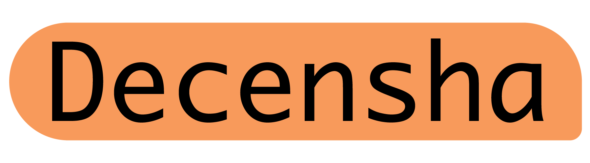

    

 

# The Decentralised Chatroom
Decensha is an open source chatroom server. This repository is a server for Decensha Client, it is provided for community hosts that are running a Decensha server.
## Prerequisites
This repository includes deployment configurations for Docker and docker-compose. It is recommended to use Docker while running Decensha server.
### Requirements (Non-Docker) ‼️NOT RECOMMENDED WITHOUT DOCKER‼️
- PostgreSQL (+15.3)
- Rust (+1.69)
- nginx

## Setup Server (Docker)
1. Run in `./runsh/docker-compose.sh` to initialize for Docker

## Build
1. `cargo build` or `cargo run`
2. `cargo build --release` for Production

## License
© 2023 leafstudiosDot and other contributors for this project.

This program is free software: you can redistribute it and/or modify it under the terms of the GNU Affero General Public License as published by the Free Software Foundation, either version 3 of the License, or (at your option) any later version.

This program is distributed in the hope that it will be useful, but WITHOUT ANY WARRANTY; without even the implied warranty of MERCHANTABILITY or FITNESS FOR A PARTICULAR PURPOSE. See the GNU Affero General Public License for more details.

You should have received a copy of the GNU Affero General Public License along with this program. If not, see https://www.gnu.org/licenses/.
